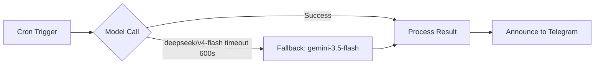

# Cấu hình Cron Jobs AIFIA

> Cập nhật lần cuối: 2026-05-29

## Tổng quan

4 cron jobs AIFIA được quản lý qua OpenClaw Gateway, chạy trên isolated session với defense-in-depth.

## Chi tiết Jobs

| Job | Schedule | Timeout | Model | Fallback |
|-----|----------|---------|-------|----------|
| **bao-gia-morning** | 08:45 T2-T6 | **600s** | deepseek/deepseek-v4-flash | google/gemini-3.5-flash |
| **bao-gia-afternoon** | 15:35 T2-T6 | **600s** | deepseek/deepseek-v4-flash | google/gemini-3.5-flash |
| **aifia-daily-full-analysis** | 16:00 daily | **600s** | deepseek/deepseek-v4-flash | google/gemini-3.5-flash |
| **aifia-health-monitor** | 10:00 daily | **600s** | deepseek/deepseek-v4-flash | google/gemini-3.5-flash |

## Defense-in-Depth Architecture

### Nguyên tắc

1. **Timeout 600s**: Deepseek đôi khi response chậm, không treo vô hạn
2. **Fallback Gemini**: Nếu deepseek timeout hoặc lỗi → tự động chuyển sang Gemini 3.5 Flash
3. **Isolated session**: Mỗi cron job chạy session riêng, không ảnh hưởng main session
4. **Vietnamese forced**: RULES.md Mục V — tất cả session buộc dùng tiếng Việt

## Lịch sử Incident

| Ngày | Job | Lỗi | Fix |
|------|-----|-----|-----|
| 2026-05-26 | bao-gia-afternoon | Session race condition (EmbeddedAttemptSessionTakeoverError) | Tách isolated session + timeout 450→600s |
| 2026-05-28 | aifia-health-monitor | English response | RULES.md Mục V |
| 2026-05-29 | aifia-health-monitor | Timeout model-call-started | Thêm fallback gemini-3.5-flash + timeout 600s |
| 2026-05-29 | aifia-daily-full-analysis | Timeout 901s (vượt 900s) | Timeout 900→600s + fallback |

## Related Scripts

- `scripts/health_monitor.py` — 7 health checks (venv, Supabase, data freshness, disk...)
- `scripts/crawl_stocks.sh` — Crawl + upload + health check pipeline
- `scripts/run_analysis.py` — AI phân tích stocks
- `scripts/run_kronos_all.py` / `run_kronos_now.py` — Kronos predictions
