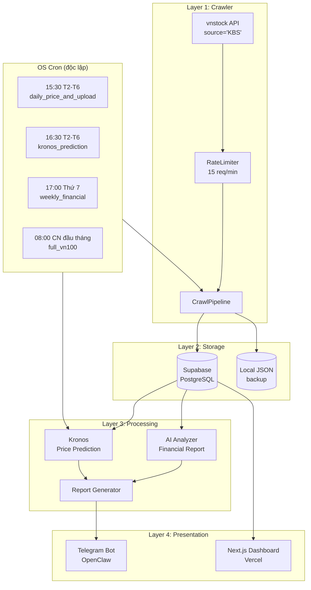

# AIFIA — AI Financial Intelligence Assistant 🏦🤖

Hệ thống AI hỗ trợ phân tích báo cáo tài chính doanh nghiệp niêm yết trên thị trường chứng khoán Việt Nam (HOSE/HNX/UPCOM).

🌐 **Live:** [aifia-wdpk.vercel.app](https://aifia-wdpk.vercel.app)

---

## 📦 Quick Start

```bash
# 1. Clone & setup Python env
python3 -m venv .venv
source .venv/bin/activate
pip install -r requirements.txt

# 2. Copy .env và điền Supabase credentials
cp .env.example .env

# 3. Kiểm tra cấu hình
set -a && source .env && set +a
./scripts/crawl_stocks.sh check_health

# 4. Crawl thử + upload lên Supabase
./scripts/crawl_stocks.sh daily_price_and_upload
```

> **⚠️ Luôn dùng `set -a && source .env && set +a`** (không chỉ `source .env`) để export biến môi trường sang Python. Nếu thiếu `set -a`, Python sẽ không thấy `SUPABASE_URL`/`SUPABASE_SERVICE_KEY`.

---

## 🧱 Kiến trúc hệ thống



| Layer | Công nghệ | Mục đích |
|-------|-----------|----------|
| **Crawler** | Python, `vnstock` ^4.0 | Thu thập dữ liệu chứng khoán |
| **Storage** | Supabase (PostgreSQL + pgvector) | Lưu trữ có cấu trúc |
| **Processing** | Kronos (OHLCV foundation model), LLM | Phân tích, dự báo |
| **Presentation** | Next.js + Tailwind (Vercel), Telegram | Hiển thị & tương tác |
| **Scheduler** | OS cron (độc lập, không phụ thuộc OpenClaw) | Tự động hóa crawl |

---

## ⏱ Chiến lược crawl

### Ma trận dữ liệu

| Loại dữ liệu | Tần suất | Thời gian chạy | Khối lượng/lần | API calls |
|---|---|---|---|---|
| **📊 Giá OHLCV** | **Mỗi ngày** (T2-T6) | 15:30 | ~100 × 22 ngày = 2,200 records | ~100 calls |
| **🔮 Dự báo Kronos** | **Mỗi ngày** (T2-T6) | 16:30 | ~100 stocks, ~5-10 phút | GPU inference |
| **📋 Báo cáo tài chính** | **Hàng tuần** | Thứ 7 17:00 | ~100 × 4 loại × 5 quý = 2,000 records | ~400 calls |
| **🏢 Thông tin công ty** | **Hàng tuần** (kèm financial) | Thứ 7 | ~100 companies | ~200 calls |
| **🔄 Full crawl** | **1 lần/tháng** | CN đầu tháng 08:00 | ~10-30 phút | ~700 calls |

### Nguyên tắc

1. **Incremental > Full:** Mỗi ngày chỉ crawl từ ngày gần nhất trong DB, không crawl lại lịch sử
2. **Rate limit an toàn:** Giới hạn 15 requests/phút, có `RateLimiter` tự động điều tiết
3. **Không chồng chéo:** Các task cách nhau >= 1 tiếng
4. **Fallback local JSON:** Nếu Supabase không available, crawl vẫn chạy và lưu file
5. **Theo nhịp thị trường:** Chỉ crawl ngày có giao dịch (T2-T6), bỏ cuối tuần & nghỉ lễ

---

## 🔧 Cài đặt OS Cron (Quan trọng)

AIFIA **không dùng cron của OpenClaw** cho việc crawl. Scheduling được thực hiện độc lập qua OS cron — crawl vẫn hoạt động kể cả khi OpenClaw tắt.

### Cách 1: Dùng file mẫu

```bash
crontab /opt/openclaw/.openclaw/workspace/aifia/scripts/aifia_crontab.txt
```

### Cách 2: Thủ công

```bash
crontab -e
```

Dán nội dung sau:

```cron
# ──────────────────────────────────────────────────────────
# AIFIA crawl schedule
# ──────────────────────────────────────────────────────────

SHELL=/bin/bash
PATH=/usr/local/bin:/usr/bin:/bin

# ⚠️ Luôn dùng set -a trước source .env để export biến sang Python

# 📊 Cập nhật giá + upload Supabase (15:30 T2-T6)
30 15 * * 1-5  cd /opt/openclaw/.openclaw/workspace/aifia && set -a && source .env && set +a && ./scripts/crawl_stocks.sh daily_price_and_upload >> logs/cron_daily_price.log 2>&1

# 🔮 Dự báo Kronos (16:30 T2-T6)
30 16 * * 1-5  cd /opt/openclaw/.openclaw/workspace/aifia && set -a && source .env && set +a && ./scripts/crawl_stocks.sh kronos_prediction >> logs/cron_kronos.log 2>&1

# 📋 Báo cáo tài chính tuần (17:00 thứ 7)
00 17 * * 6    cd /opt/openclaw/.openclaw/workspace/aifia && set -a && source .env && set +a && ./scripts/crawl_stocks.sh weekly_financial >> logs/cron_weekly_financial.log 2>&1

# 🔄 Full crawl tháng (08:00 CN đầu tháng)
00 08 1-7 * 0  cd /opt/openclaw/.openclaw/workspace/aifia && set -a && source .env && set +a && ./scripts/crawl_stocks.sh full_vn100 >> logs/cron_full_vn100.log 2>&1
```

> ⚠️ **Bảo mật:** Không hardcode secret vào crontab. File `.env` đã được gitignore.
> ⚠️ **Quan trọng:** `set -a` là bắt buộc — nếu chỉ `source .env`, Python sẽ không thấy biến môi trường.

### Kiểm tra cron

```bash
crontab -l                                          # Danh sách cron đang active
tail -f logs/cron_daily_price.log                   # Log crawl giá
tail -f logs/crawl_$(date +%Y%m%d).log              # Log crawl tổng hợp
```

---

## 🚀 Hướng dẫn sử dụng

### Crawl Controller

```bash
# Kiểm tra cấu hình (Python, Supabase, disk space)
./scripts/crawl_stocks.sh check_health

# Crawl giá + upload lên Supabase (khuyên dùng)
./scripts/crawl_stocks.sh daily_price_and_upload

# Crawl giá (local JSON, không upload)
./scripts/crawl_stocks.sh daily_price

# Crawl báo cáo tài chính & thông tin công ty
./scripts/crawl_stocks.sh weekly_financial

# Full crawl toàn bộ VN100
./scripts/crawl_stocks.sh full_vn100

# Chạy Kronos prediction
./scripts/crawl_stocks.sh kronos_prediction
```

### Crawl Script (low-level)

```bash
set -a && source .env && set +a
python scripts/run_crawler.py --price-only --incremental --symbols ACB VCB FPT
python scripts/run_crawler.py --financial-only --symbols ACB VCB
python scripts/run_crawler.py --symbols ALL --years 5
```

Tham số:

| Flag | Mô tả |
|---|---|
| `--symbols` | Mã CK (VD: `ACB VCB` hoặc `ALL` cho VN100) |
| `--price-only` | Chỉ crawl giá OHLCV |
| `--financial-only` | Chỉ crawl báo cáo tài chính |
| `--incremental` | Chỉ lấy dữ liệu mới từ ngày gần nhất |
| `--years N` | Số năm dữ liệu tài chính (mặc định 5) |
| `--batch-size N` | Số mã mỗi batch (mặc định 10) |
| `--dry-run` | Chạy thử, không ghi vào Supabase |

### Upload lên Supabase

```bash
# Upload incremental (chỉ đẩy record mới nhất)
set -a && source .env && set +a
python scripts/upload_prices.py --incremental

# Upload toàn bộ (đẩy lại tất cả records hiện có)
python scripts/upload_prices.py
```

### OpenClaw / Telegram

Các workflow OpenClaw dùng cho **tra cứu và phân tích nâng cao**, không dùng để schedule crawl:

- `daily_crawl.yaml` — ⚠️ Legacy (crawl giờ qua OS cron)
- `daily_full_analysis.yaml` — Phân tích 100 mã + AI enhancement (18:30 T2-T6)
- `daily_summary.yaml` — Báo cáo tổng quan thị trường cuối ngày
- `analyze_symbol.yaml` — Tra cứu mã CK theo yêu cầu qua Telegram

---

## 📁 Cấu trúc project

```
aifia/
├── README.md                       # This file
├── ARCHITECTURE.md                 # Kiến trúc chi tiết
├── PLAN.md                         # Kế hoạch phát triển
├── requirements.txt                # Python dependencies
├── .env.example                    # Mẫu biến môi trường
├── .gitignore
│
├── crawler/                        # Layer 1: Data Crawler
│   ├── pipeline.py                 # CrawlPipeline orchestrator
│   ├── config.py                   # CrawlerConfig
│   ├── sources/
│   │   └── vnstock_source.py       # Vnstock API integration
│   ├── extractors/                 # Data parsing
│   └── storage/
│       └── __init__.py             # SupabaseStorage client
│
├── processing/                     # Layer 3: AI & Analysis
│   ├── config.py
│   ├── financial_analyzer.py       # Financial report analysis
│   ├── kronos_analyzer.py          # Kronos integration
│   └── report_generator.py         # Report aggregation
│
├── data/                           # Local JSON (backup khi Supabase offline)
│   ├── vn100_symbols.json          # Danh sách VN100
│   ├── price_*.json                # Price history mỗi mã
│   ├── financial_*.json            # Báo cáo tài chính mỗi mã
│   ├── company_*.json              # Thông tin công ty
│   ├── history/YYYY-MM-DD/         # Phân tích theo ngày
│   │   ├── batch_*.json            # Crawl batch data
│   │   ├── ai_batch_*.json         # AI-enhanced analysis
│   │   └── _summary.json           # Tổng kết ngày
│   ├── predictions/                # Output Kronos
│   │   └── kronos_vn100_*.json
│   └── crawl_summary.json
│
├── scripts/                        # Entry point scripts
│   ├── crawl_stocks.sh             # Master controller (OS cron)
│   ├── aifia_crontab.txt           # Mẫu crontab
│   ├── run_crawler.py              # Crawl engine
│   ├── upload_prices.py            # Upload incremental lên Supabase
│   ├── daily_full_analysis.py      # Phân tích 100 mã + AI
│   ├── ai_upload.py                # Upload AI analysis lên Supabase
│   ├── import_to_supabase.py       # Import tất cả JSON lên Supabase
│   ├── run_analysis.py             # Phân tích AI
│   ├── run_kronos_now.py           # Kronos trên 3-5 mã
│   └── run_kronos_all.py           # Kronos trên toàn bộ VN100
│
├── supabase/
│   └── schema.sql                  # Full schema (7 tables)
│
├── logs/                           # Log crawl tự động
│   ├── crawl_YYYYMMDD.log
│   ├── daily_price_YYYYMMDD.log
│   ├── cron_daily_price.log
│   ├── kronos_pred_YYYYMMDD.log
│   └── ...
│
├── openclaw/                       # OpenClaw workflows
│   └── workflows/
│       ├── daily_crawl.yaml        # Legacy (OS cron thay thế)
│       ├── daily_full_analysis.yaml
│       ├── daily_summary.yaml
│       └── analyze_symbol.yaml
│
└── vercel-frontend/                # Next.js (aifia-wdpk.vercel.app)
    ├── src/
    │   └── app/
    │       ├── page.tsx            # Dashboard A-Z
    │       ├── company/[symbol]    # Trang chi tiết cổ phiếu
    │       └── api/db/route.ts     # API proxy → Supabase
    ├── package.json
    └── next.config.js
```

---

## 🧪 Tech Stack

| Layer | Công nghệ |
|---|---|
| Crawler | Python 3.12+, `vnstock` ^4.0, `pandas`, `numpy` |
| Storage | Supabase (PostgreSQL + pgvector) + local JSON |
| Prediction | Kronos (OHLCV foundation model) |
| AI Analysis | OpenAI / Anthropic API (optional) |
| Scheduler | **OS cron** (độc lập, không phụ thuộc OpenClaw) |
| Frontend | Next.js + Tailwind + Recharts (Vercel) |
| Bot | OpenClaw (Telegram tra cứu) |

---

## 📊 Supabase Schema

7 tables (live):

| Table | Mục đích | PK |
|---|---|---|
| **`companies`** | Thông tin doanh nghiệp | symbol |
| **`financial_reports`** | BCTC theo quý (income/balance/cashflow/ratio) | symbol + quarter + year + report_type |
| **`price_history`** | Giá OHLCV hàng ngày (~197K records) | symbol + date |
| **`macro_data`** | Dữ liệu vĩ mô | indicator + period |
| **`analysis_results`** | Kết quả phân tích AI | — |
| **`kronos_predictions`** | Dự báo giá từ Kronos | — |
| **`company_highlights`** | Điểm nổi bật doanh nghiệp | — |

Xem chi tiết: [`supabase/schema.sql`](supabase/schema.sql)

---

## 🔐 Environment

```env
SUPABASE_URL=https://your-project.supabase.co
SUPABASE_SERVICE_KEY=your_service_role_key
VNSTOCK_API_KEY=vnstock_xxx
OPENAI_API_KEY=sk-...
OPENAI_MODEL=gpt-4o-mini
OPENAI_EMBEDDING_MODEL=text-embedding-3-small
AI_CHAT_TIMEOUT_MS=35000

# Optional, used by /api/chat when Supabase has vector documents indexed
ENABLE_VECTOR_RAG=true
SUPABASE_VECTOR_RPC=match_documents
VECTOR_MATCH_COUNT=8
VECTOR_MATCH_THRESHOLD=0.70
```

> **Security:** `SUPABASE_SERVICE_KEY` có quyền service role. Chỉ đặt trên server, không commit lên Git.
> **Vnstock:** `VNSTOCK_API_KEY` được dùng ở crawler/server-side. Không đưa key vào biến `NEXT_PUBLIC_*`.
> **Vector RAG:** nếu live DB chưa có RPC `match_documents`, có thể áp dụng mẫu [`supabase/vector_search.sql`](supabase/vector_search.sql).

---

## 📈 Monitoring

```bash
tail -f logs/cron_daily_price.log           # Cron crawl giá
tail -f logs/crawl_$(date +%Y%m%d).log      # Log crawl tổng hợp
cat data/crawl_summary.json                  # Tổng kết lần crawl gần nhất
```

---

## 📄 License

MIT
