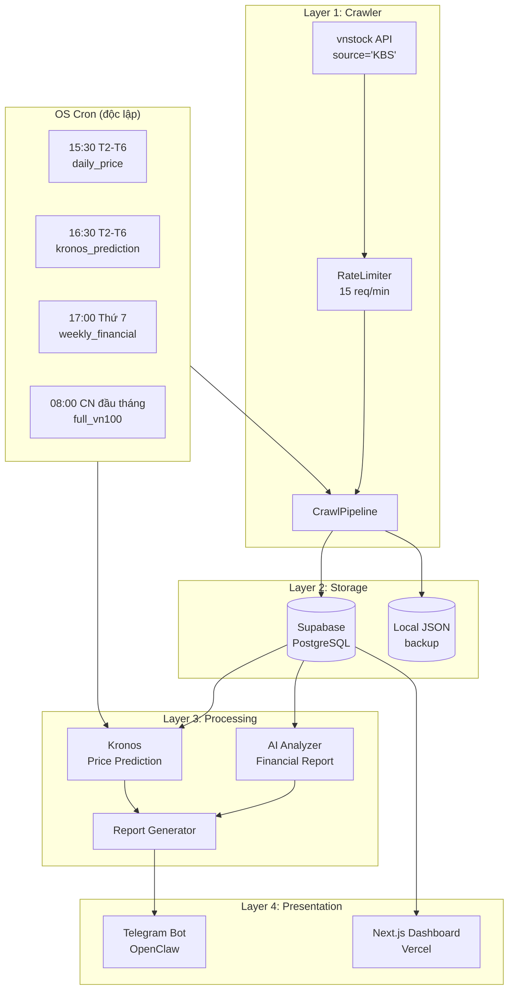

# AIFIA — AI Financial Intelligence Assistant 🏦🤖

Hệ thống AI hỗ trợ phân tích báo cáo tài chính doanh nghiệp niêm yết trên thị trường chứng khoán Việt Nam (HOSE/HNX/UPCOM).

---

## 📦 Quick Start

```bash
# 1. Clone & setup Python env
python3 -m venv .venv
source .venv/bin/activate
pip install -r requirements.txt

# 2. Copy .env và điền Supabase credentials
cp .env.example .env

# 3. Crawl thử 5 mã
source .env
./scripts/crawl_stocks.sh check_health
./scripts/crawl_stocks.sh daily_price
```

---

## 🧱 Kiến trúc hệ thống



| Layer | Công nghệ | Mục đích |
|-------|-----------|----------|
| **Crawler** | Python, `vnstock` ^4.0 | Thu thập dữ liệu chứng khoán |
| **Storage** | Supabase (PostgreSQL + pgvector) | Lưu trữ có cấu trúc |
| **Processing** | Kronos (OHLCV foundation model), LLM | Phân tích, dự báo |
| **Presentation** | Next.js + Tailwind (Vercel), Telegram | Hiển thị & tương tác |
| **Scheduler** | OS cron (độc lập, không phụ thuộc OpenClaw) | Tự động hóa crawl |

---

## ⏱ Chiến lược crawl

### Ma trận dữ liệu

| Loại dữ liệu | Tần suất | Thời gian chạy | Khối lượng/lần | API calls |
|---|---|---|---|---|
| **📊 Giá OHLCV** | **Mỗi ngày** (T2-T6) | 15:30 | ~100 × 22 ngày = 2,200 records | ~100 calls |
| **🔮 Dự báo Kronos** | **Mỗi ngày** (T2-T6) | 16:30 | ~100 stocks, ~5-10 phút | GPU inference |
| **📋 Báo cáo tài chính** | **Hàng tuần** | Thứ 7 17:00 | ~100 × 4 loại × 5 quý = 2,000 records | ~400 calls |
| **🏢 Thông tin công ty** | **Hàng tuần** (kèm financial) | Thứ 7 | ~100 companies | ~200 calls |
| **🔄 Full crawl** | **1 lần/tháng** | CN đầu tháng 08:00 | ~10-30 phút | ~700 calls |

### Nguyên tắc

1. **Incremental > Full:** Mỗi ngày chỉ crawl từ ngày gần nhất trong DB, không crawl lại lịch sử
2. **Rate limit an toàn:** Giới hạn 15 requests/phút, có `RateLimiter` tự động điều tiết
3. **Không chồng chéo:** Các task cách nhau >= 1 tiếng
4. **Fallback local JSON:** Nếu Supabase không available, crawl vẫn chạy và lưu file
5. **Theo nhịp thị trường:** Chỉ crawl ngày có giao dịch (T2-T6), bỏ cuối tuần & nghỉ lễ

### Dung lượng

| Hạng mục | Tháng | Năm |
|---|---|---|
| Price history (100 stocks × 22 ngày) | ~11 MB | ~132 MB |
| Financial reports (4 loại × 5 quý × 100 stocks) | ~5 MB | ~10 MB |
| Company info (100 stocks) | ~2 MB | ~2 MB |
| Kronos predictions | ~3 MB | ~36 MB |
| **Tổng** | **~21 MB** | **~180 MB** |

---

## 🔧 Cài đặt OS Cron (Quan trọng)

AIFIA **không dùng cron của OpenClaw** cho việc crawl. Scheduling được thực hiện độc lập qua OS cron — crawl vẫn hoạt động kể cả khi OpenClaw tắt.

### Cách 1: Dùng file mẫu

```bash
crontab /opt/openclaw/.openclaw/workspace/aifia/scripts/aifia_crontab.txt
```

### Cách 2: Thủ công

```bash
crontab -e
```

Dán nội dung sau (thay `<SUPABASE_SERVICE_KEY>` bằng key thật):

```cron
# ──────────────────────────────────────────────────────────
# AIFIA crawl schedule
# ──────────────────────────────────────────────────────────

# Biến môi trường (load từ .env — KHÔNG hardcode secret)
SHELL=/bin/bash
PATH=/usr/local/bin:/usr/bin:/bin

# 📊 Cập nhật giá hàng ngày (15:30 T2-T6)
30 15 * * 1-5  cd /opt/openclaw/.openclaw/workspace/aifia && source .env && ./scripts/crawl_stocks.sh daily_price >> logs/cron_daily_price.log 2>&1

# 🔮 Dự báo Kronos (16:30 T2-T6)
30 16 * * 1-5  cd /opt/openclaw/.openclaw/workspace/aifia && source .env && ./scripts/crawl_stocks.sh kronos_prediction >> logs/cron_kronos.log 2>&1

# 📋 Báo cáo tài chính tuần (17:00 thứ 7)
00 17 * * 6    cd /opt/openclaw/.openclaw/workspace/aifia && source .env && ./scripts/crawl_stocks.sh weekly_financial >> logs/cron_weekly_financial.log 2>&1

# 🔄 Full crawl tháng (08:00 CN đầu tháng)
00 08 1-7 * 0  cd /opt/openclaw/.openclaw/workspace/aifia && source .env && ./scripts/crawl_stocks.sh full_vn100 >> logs/cron_full_vn100.log 2>&1
```

> ⚠️ **Bảo mật:** Không hardcode `SUPABASE_SERVICE_KEY` vào crontab. File `.env` đã được gitignore nên an toàn. Crontab chỉ cần lệnh `source .env` trước khi chạy script.

### Kiểm tra cron đã chạy chưa

```bash
# Danh sách cron đang active
crontab -l

# Log của từng task
tail -f /opt/openclaw/.openclaw/workspace/aifia/logs/cron_daily_price.log
tail -f /opt/openclaw/.openclaw/workspace/aifia/logs/cron_kronos.log

# Log crawl tổng hợp
tail -f /opt/openclaw/.openclaw/workspace/aifia/logs/crawl_$(date +%Y%m%d).log
```

---

## 🚀 Hướng dẫn sử dụng

### Crawl Controller

```bash
# Kiểm tra cấu hình (Python, Supabase, disk space)
./scripts/crawl_stocks.sh check_health

# Crawl giá OHLCV (incremental — chỉ lấy ngày mới)
./scripts/crawl_stocks.sh daily_price

# Crawl báo cáo tài chính & thông tin công ty
./scripts/crawl_stocks.sh weekly_financial

# Full crawl toàn bộ VN100
./scripts/crawl_stocks.sh full_vn100

# Chạy Kronos prediction
./scripts/crawl_stocks.sh kronos_prediction
```

### Crawl Script (low-level)

```bash
# Chạy trực tiếp với tùy chọn
source .env
python scripts/run_crawler.py --price-only --incremental --symbols ACB VCB FPT
python scripts/run_crawler.py --financial-only --symbols ACB VCB
python scripts/run_crawler.py --symbols ALL --years 5
```

Tham số:

| Flag | Mô tả |
|---|---|
| `--symbols` | Mã CK (VD: `ACB VCB` hoặc `ALL` cho VN100) |
| `--price-only` | Chỉ crawl giá OHLCV |
| `--financial-only` | Chỉ crawl báo cáo tài chính |
| `--incremental` | Chỉ lấy dữ liệu mới từ ngày gần nhất |
| `--years N` | Số năm dữ liệu tài chính (mặc định 5) |
| `--batch-size N` | Số mã mỗi batch (mặc định 10) |
| `--dry-run` | Chạy thử, không ghi vào Supabase |

### OpenClaw / Telegram

Các workflow OpenClaw (trong `openclaw/workflows/`) vẫn hoạt động cho mục đích **tra cứu và tương tác**, không còn dùng để schedule crawl:

- `analyze_symbol.yaml` — Phân tích mã CK theo yêu cầu qua Telegram
- `daily_crawl.yaml` — **Không còn dùng** (giữ lại cho tương thích)

---

## 📁 Cấu trúc project

```
aifia/
├── README.md                       # This file
├── ARCHITECTURE.md                 # Kiến trúc chi tiết
├── PLAN.md                         # Kế hoạch phát triển
├── requirements.txt                # Python dependencies
├── .env.example                    # Mẫu biến môi trường
├── .gitignore
│
├── crawler/                        # Layer 1: Data Crawler
│   ├── __init__.py
│   ├── pipeline.py                 # CrawlPipeline orchestrator
│   ├── config.py                   # CrawlerConfig
│   ├── sources/
│   │   ├── vnstock_source.py       # Vnstock API integration
│   │   └── ...
│   ├── extractors/                 # Data parsing
│   └── storage/
│       └── __init__.py             # SupabaseStorage client
│
├── processing/                     # Layer 3: AI & Analysis
│   ├── config.py
│   ├── financial_analyzer.py       # Financial report analysis
│   ├── kronos_analyzer.py          # Kronos integration
│   └── report_generator.py         # Report aggregation
│
├── data/                           # Local JSON (backup khi Supabase offline)
│   ├── vn100_symbols.json          # Danh sách VN100
│   ├── price_*.json                # Price history mỗi mã
│   ├── financial_*.json            # Báo cáo tài chính mỗi mã
│   ├── company_*.json              # Thông tin công ty
│   ├── crawl_summary.json          # Tổng kết lần crawl gần nhất
│   └── predictions/                # Output Kronos
│       └── kronos_vn100_*.json
│
├── scripts/                        # Entry point scripts
│   ├── crawl_stocks.sh             # 🆕 Master controller (OS cron entry point)
│   ├── aifia_crontab.txt           # 🆕 Mẫu crontab cho OS cron
│   ├── run_crawler.py              # 🆕 Đã thêm --price-only, --financial-only, --incremental
│   ├── run_analysis.py             # Phân tích AI
│   ├── run_kronos_now.py           # Kronos trên 3-5 mã
│   ├── run_kronos_all.py           # Kronos trên toàn bộ VN100
│   └── import_to_supabase.py       # Import dữ liệu JSON lên Supabase
│
├── supabase/
│   ├── schema.sql                  # Full schema
│   └── migrations/
│
├── logs/                           # 🆕 Log crawl tự động
│   ├── crawl_YYYYMMDD.log          # Log tổng hợp
│   ├── cron_daily_price.log        # Log cron daily
│   ├── cron_kronos.log             # Log cron Kronos
│   ├── weekly_financial.log        # Log crawl tài chính
│   └── ...
│
├── openclaw/                       # OpenClaw integration
│   └── workflows/
│       ├── analyze_symbol.yaml     # Tra cứu mã CK qua Telegram
│       └── daily_crawl.yaml        # ⚠️ Legacy — crawl giờ qua OS cron
│
└── vercel-frontend/                # Next.js dashboard
```

---

## 🧪 Tech Stack

| Layer | Công nghệ |
|---|---|
| Crawler | Python 3.12+, `vnstock` ^4.0, `pandas`, `numpy` |
| Storage | Supabase (PostgreSQL + pgvector) + local JSON |
| Prediction | Kronos (OHLCV foundation model, 24.7M params) |
| AI Analysis | OpenAI / Anthropic API (optional) |
| Scheduler | **OS cron** (độc lập, không phụ thuộc OpenClaw) |
| Frontend | Next.js 14 + Tailwind + Recharts (Vercel) |
| Bot | OpenClaw (Telegram tra cứu) |

---

## 📊 Supabase Schema

6 tables chính:

- **`companies`** — Thông tin doanh nghiệp (symbol PK)
- **`financial_reports`** — Báo cáo tài chính theo quý (composite PK: symbol + quarter + year + report_type)
- **`price_history`** — Dữ liệu giá hàng ngày (composite PK: symbol + date)
- **`macro_data`** — Dữ liệu vĩ mô (indicator + period)
- **`analysis_results`** — Kết quả phân tích AI
- **`kronos_predictions`** — Dự báo giá từ Kronos

Xem chi tiết: [`supabase/schema.sql`](supabase/schema.sql)

---

## 🔐 Environment

```env
SUPABASE_URL=https://your-project.supabase.co
SUPABASE_SERVICE_KEY=your_service_role_key
```

> **Security:** `SUPABASE_SERVICE_KEY` có quyền service role. Chỉ đặt trên server, không commit lên Git.

---

## 📈 Monitoring

Cron log: `tail -f logs/cron_*.log`
Crawl log: `tail -f logs/crawl_$(date +%Y%m%d).log`
Crawl summary: `data/crawl_summary.json`

Phát hiện lỗi qua exit code (cron sẽ gửi mail nếu configured) và log chi tiết từng task.

---

## 📄 License

MIT
